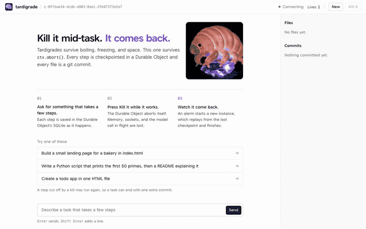

# tardigrade

**A reference app for [Pi Durable](https://github.com/earendil-works/pi/tree/main/packages/durable), [Effect v4](https://effect.website), and [Foldkit](https://foldkit.dev) on Cloudflare: a coding agent you can kill mid-task, that comes back and finishes.**

Give it a task and press **Kill it** while it works. Its Durable Object calls `ctx.abort()` on itself, so memory, sockets, and the model call in flight are gone. A second later a fresh instance reads the same SQLite, continues from the last saved step, and finishes. The conversation, the files, and the record of every kill survive, in every tab and after a refresh.



*A real run: five kills, about one every 9.5 seconds. The kills play at 1.6×, the rest at 4×. It ends with 6 lives, one file, and one commit. [MP4](docs/kill5.mp4).*

tardigrade is a reference app to read and fork, and to run for yourself behind Cloudflare Access. It is not a hosted product, and it is not safe on the open internet: anyone who can open it spends your Workers AI budget.

## What each piece shows

### Pi Durable: the agent survives `ctx.abort()`

Pi Durable commits each model turn and each tool result to the Durable Object's SQLite before the next step starts. After a crash, the same request is submitted again under the same ID, and Pi continues from the last commit. Each tool declares that running it twice is safe ([`worker/harness.ts`](worker/harness.ts)):

```ts
defineTool({
	name: "write_file",
	description: "Create or replace a whole file. Each call is one git commit.",
	parameters: Type.Object({
		path: Type.String(),
		content: Type.String(),
		message: Type.Optional(Type.String({ description: "Commit message" })),
	}),
	replay: "safe",
	executionMode: "sequential",
	execute: (args) =>
		run(
			repo.write(args.path, args.content, args.message ?? `Write ${args.path}`).pipe(
				Effect.tap(() => filesChanged(repo)),
				Effect.map(({ oid, changed }) => text(`${changed ? `Committed ${oid.slice(0, 7)}` : "Already up to date"}: ${args.path}`)),
			),
		),
}),
```

In Pi Durable, `replay: "safe"` means an interrupted run of the tool may run again on recovery, with the arguments Pi recorded. `write_file` meets that: the same path and content make no new commit. The one extra commit a kill can cost comes from somewhere else. If the kill lands before Pi records the tool call, the model writes that step again, and its new content can differ.

The SQLite adapter that lets Pi Durable use a Durable Object's storage is checked against Pi's own 23-case storage suite inside real workerd ([`test/conformance/`](test/conformance)).

### Effect v4: the Durable Object is an Effect program

The Durable Object class is a thin shell. It builds one `ManagedRuntime` per object from Layers, and every RPC method runs an Effect inside it. The model and the file store are Layers too, so the test suite swaps in Pi's fake model and storage-backed files and runs the real agent offline ([`worker/agent.ts`](worker/agent.ts)):

```ts
export const conversationLayer = (ctx: DurableObjectState, model: Layer.Layer<Model>, files: Layer.Layer<Repo, RepoUnavailable>) => {
	const object = Layer.mergeAll(DurableObjectContext.layer(ctx), Store.layer(ctx.storage));
	const broadcast = Broadcast.layer.pipe(Layer.provideMerge(object));
	const pi = Pi.layer(ctx.storage).pipe(Layer.provide(files), Layer.provideMerge(model), Layer.provideMerge(broadcast));

	return ConversationAgent.layer.pipe(Layer.provideMerge(pi));
};
```

The Pi harness is a scoped resource. `Effect.acquireRelease` opens it and closes it with the runtime, and Pi's live document becomes a `Stream` ([`worker/harness.ts`](worker/harness.ts)). Kill is an `Effect.gen` with a typed failure. It is stored and synced before any tab hears about it ([`worker/conversation.ts`](worker/conversation.ts)):

```ts
const kill = Effect.gen(function* () {
	const at = yield* now;
	const running = Option.isSome(yield* store.pending) && Option.isNone(yield* store.killedAt);

	if (!running) return yield* Effect.fail(new NothingRunning());

	yield* store.recordKill(at);

	const wasBusy = yield* Ref.get(driving);

	const events = yield* store.addEvent(KilledEvent.make({ at, afterBlock: yield* blockCount, wasBusy }));

	yield* object.setAlarm(at + REVIVE_AFTER_MS).pipe(Effect.andThen(object.flush), Effect.mapError(({ step, reason }) => new KillNotSaved({ reason: `${step}: ${reason}` })));
	yield* broadcast.send(EventsFrame.make({ events }));
	yield* broadcast.send(KilledFrame.make({ killedAt: at }));

	return yield* object.abort(KILLED_FROM_THE_UI);
});
```

On the wire, [`shared/protocol.ts`](shared/protocol.ts) defines every request, frame, timeline event, and error as a Schema, and both sides import it. Requests are an `effect/rpc` group over HTTP. Pushes are Schema-encoded frames over a hibernatable WebSocket.

Effect does not make the agent durable. Pi Durable and SQLite do that. Effect makes the lifetimes, the failures, and the wire format explicit.

### Foldkit: the UI is a pure `update`, tested without a browser

The page is one Model, one `update`, and typed Messages. The socket is a managed resource keyed on a connection epoch, so a dropped socket reconnects on its own. Every kill-and-comeback scenario is a story test that runs in milliseconds ([`client/src/story.test.ts`](client/src/story.test.ts)):

```ts
test("a page opened after a kill, before the comeback, shows the kill and that it is coming back", () => {
	story(
		update,
		given(fresh),
		message(Message.SocketOpened()),
		message(frame(SnapshotFrame.make({ snapshot: snapshot({ busy: true, lives: 2, events: [killed], killedAt: Option.some(5_000) }) }))),
		model((current) => {
			expect(current.events).toEqual([killed]);
			expect(current.phase).toEqual(Phase.Reviving({ killedAt: 5_000 }));
		}),
	);
});
```

## How it fits together

```
browser (Foldkit)
   │  effect/rpc over HTTP ─────▶ Worker: checks Access, forwards
   │  WebSocket (hibernatable) ─▶ Worker: checks Access, passes the socket through
   ▼
Durable Object "Agent", one per conversation, an Effect ManagedRuntime
   ├─ Pi Durable harness, saved in the object's SQLite
   ├─ timeline of kills and comebacks, in the same storage
   └─ files: one Artifacts git repo, a commit per write
```

### What happens when you press Kill it

1. The object records the kill in storage (the time, and where in the transcript it happened). It counts one more life and sets an alarm for one second later. A Kill that reaches the same instance while a kill is pending is refused with `NothingRunning`. A Kill that arrives after the comeback is a new kill: three quick clicks can cost the agent up to three lives, and it still finishes.
2. It awaits `storage.sync()`, so that record cannot be lost. Only then does it tell open tabs about the kill, and call `ctx.abort()`.
3. The runtime discards the instance. Everything in memory is gone: the in-flight model call, the open WebSockets, and any unsaved work.
4. The next event for the object gets a fresh instance. That event is the alarm or the page reconnecting, whichever comes first. The fresh instance reads the same SQLite, finds the unfinished request, records a comeback, and submits the request again under the same ID.
5. Pi Durable continues from the last committed step. The step that was cut off runs again, so a model call that was in flight is made again.
6. Every open tab gets the new state over its WebSocket. The kill and the comeback are read from storage, so a refresh, or a tab opened later, shows the same transcript.

The same path covers deaths you did not cause. While a task runs, the object keeps a 15-second watchdog alarm. After a deploy, an eviction, or an uncaught exception, the next instance finds the unfinished request with no kill recorded, adds a **Restarted** line to the timeline, and picks the task back up. The watchdog revives a dead instance; it does not time out a live one that is slow.

### Replay is at-least-once

A kill can land after a tool ran but before its result was committed. That tool then runs again, so every tool must be safe to run twice:

| Tool | If it runs twice |
| --- | --- |
| `list_files`, `read_file` | Nothing changes. They only read. |
| `write_file` | Same path and same content make no new commit. If the model produced the step again with different content, there is one more commit. |

A task can end with one extra commit. It does not end with lost work. tardigrade does not promise exactly-once.

## Proof

### Kill it five times

`npm run kill5` sends a task, kills the agent five times (it waits `KILL_EVERY_MS`, 7 seconds by default, then kills, then checks for 2.5 seconds: about one kill every 9.5 seconds), and waits. If the task finishes before all five kills, the run fails: use a longer `TASK` or a shorter `KILL_EVERY_MS`. It passes only if all of these are true:

- There are 6 lives.
- The task finished.
- There is at least one commit and one file.
- The stored timeline has exactly 5 kills and 5 comebacks.

A real run against `npm run dev`:

```
c-…
send Success
kill 1: lives=2 busy=true
kill 2: lives=3 busy=true
kill 3: lives=4 busy=true
kill 4: lives=5 busy=true
kill 5: lives=6 busy=true
{"lives":6,"busy":false,"commits":1,"files":["index.html"],"replies":2,"timeline":"Killed,Back,Killed,Back,Killed,Back,Killed,Back,Killed,Back"}
# 2026-10-07, exit 0
```

### The whole agent, killed three times, offline

[`test/revival/`](test/revival) runs the real `Agent` Durable Object and the real `conversationLayer` inside workerd, with two Layers swapped: Pi's fake model, and files kept in the object's own storage ([`stored-repo.ts`](test/revival/stored-repo.ts), test code only). A second case swaps in a repo that rejects every push, and requires the model to get a clear tool error and the run to end. It sends a task, kills the object three times with `ctx.abort()` while it works, and requires 4 lives, exactly `Killed, Back` three times in the stored timeline, and the finished file. It needs no account and no network, and it runs on every `npm run check`.

### Pi Durable's storage suite, inside the real runtime

Pi Durable has a 23-case conformance suite for storage backends. Pi's own tests run the Durable Object adapter against a Node SQLite stand-in. [`test/conformance/`](test/conformance) instead starts real workerd with `wrangler`, opens the adapter on a Durable Object's SQLite, and runs the whole suite there. That checks transactions, ordering, and value types as the real runtime implements them. The test requires exactly 23 results, all passing, on every `npm run check`.

### Every refresh shows the same page

The transcript is rebuilt from storage on every connect, not from what one tab saw. The story tests in [`client/src/story.test.ts`](client/src/story.test.ts) cover these cases:

- A page opened after a kill, before the comeback.
- A page opened after the comeback.
- A socket that reconnects and replaces the page's guess with the stored events.

## Run it locally

Before you start, you need:

- Node 22.19 or newer.
- A Cloudflare account with Workers AI.
- [Artifacts](https://developers.cloudflare.com/artifacts/) enabled in the dashboard. Artifacts is in beta. Without it, the first `write_file` fails.

```sh
npm install
npx wrangler login
npm run dev          # http://localhost:8787
```

Workers AI and Artifacts have no local simulator, so `npm run dev` uses the real services through remote bindings. Local runs spend your Workers AI quota and create real Artifacts repos, one per conversation. For costs, see [Workers AI pricing](https://developers.cloudflare.com/workers-ai/platform/pricing/) and the [Artifacts docs](https://developers.cloudflare.com/artifacts/).

`npm run dev` skips the Access check, and only for requests to `localhost`, `127.0.0.1`, or `[::1]`. Run one dev server per checkout: two servers on the same `.wrangler/state` folder both run the same Durable Object and corrupt its SQLite, so `npm run dev` refuses to start a second one.

```sh
npm run check                              # typecheck, lint, tests (stories, storage suite, offline revival), README excerpt check, build, config and secret checks
BASE=http://localhost:8787 npm run check   # the same, plus the five-kill run
```

The five-kill run calls the Worker without an Access token. It works against `npm run dev`, not against a deployed Worker.

## Deploy behind Cloudflare Access

tardigrade is locked by default. Every request, including the page and its images, must carry a Cloudflare Access token, and the Worker verifies the token itself: the signature against your team's keys, the audience, the issuer, and the expiry. There is no `workers.dev` or preview URL (`workers_dev: false`, `preview_urls: false`), so your Access hostname is the only way in.

You need a Zero Trust team and a zone in your account with a free Workers custom-domain slot (each zone allows 100).

1. Add your hostname to `wrangler.jsonc`:

   ```jsonc
   "routes": [{ "pattern": "tardigrade.example.com", "custom_domain": true }]
   ```

2. In Zero Trust, open **Access > Applications** and add a **self-hosted** application for that hostname. Give it one **Allow** policy that includes only your email address. Do not add a Bypass policy.
3. On the application's **Overview** tab, copy the **Application Audience (AUD) Tag**. In `wrangler.jsonc`, set `vars.ACCESS_AUD` to that tag and `vars.ACCESS_TEAM_DOMAIN` to `https://<your-team>.cloudflareaccess.com`. Neither value is a secret.
4. Optionally, set `vars.MODEL` to any Workers AI model with function calling. The default, `@cf/zai-org/glm-5.3`, streams tool arguments, so the page can show a file while it is being written.
5. Run `npm run deploy`. Wrangler deploys to the account you are logged in to; there is no account ID to configure.

Then open your hostname, sign in through Access, and give it a task.

## When it breaks

| You see | It means | Do this |
| --- | --- | --- |
| `503 tardigrade is locked` | `ACCESS_TEAM_DOMAIN` or `ACCESS_AUD` is missing or malformed. | Set both in `vars`, then deploy again. |
| `401 sign in through Cloudflare Access` | The request had no Access token, so the hostname is probably not covered by your Access application. | Make sure the application's domain matches the route exactly. |
| `403 Access token rejected: wrong audience` | The token is for a different Access application. | Copy `ACCESS_AUD` from this application's Overview tab. |
| `403 Access token rejected: …` (any other reason) | The token is expired, malformed, or from another team. The reason names the failed check. | Sign in again. If it repeats, check `ACCESS_TEAM_DOMAIN`. |
| A write fails and the agent reports an error | Artifacts is not enabled, or the push was rejected twice in a row (a push is retried once). | Enable Artifacts, then send the task again. |
| **Working** for a long time | The model or Artifacts is slow. The watchdog revives a dead instance within 15 seconds, but it does not cancel a slow live one. | Press **Kill it**. The comeback resumes the task. |
| Locally, a conversation stops loading with `unresolvable path: ["generation"]` | Two `wrangler dev` servers shared one `.wrangler/state` folder, so two copies of the same Durable Object wrote to one SQLite file. That cannot happen on Cloudflare, where each object runs once. | `npm run dev` refuses to start a second server on the same folder. If you start `wrangler dev` by hand, give each server its own `--persist-to`. Press **New** for a fresh conversation. |

The Worker also refuses writes and WebSocket connections from other origins, so another site cannot drive your agent through your signed-in browser.

## Layout

| Path | What it does |
| --- | --- |
| `shared/protocol.ts` | Schemas for every request, frame, timeline event, and error, imported by both sides |
| `worker/index.ts` | Checks Access on every request, serves the RPC group, checks the origin, and forwards the WebSocket to the conversation's Durable Object |
| `worker/access.ts` | Verifies the Access token: signature, audience, issuer, and expiry |
| `worker/agent.ts` | The `Agent` Durable Object: a thin shell that builds one Effect `ManagedRuntime` from Layers and runs each RPC in it |
| `worker/conversation.ts` | The agent as an Effect service: send, kill, comeback, the run to the end, and the watchdog |
| `worker/harness.ts` | The Pi Durable harness as a scoped Layer: tools, the live document as a `Stream`, and the run |
| `worker/services.ts` | Small services for the Durable Object context, its storage, and the WebSocket broadcast |
| `worker/meta.ts` | Small keyed state in the object's storage: the pending request, lives, and the timeline |
| `worker/view.ts` | Turns Pi's messages into the blocks the page shows |
| `worker/files.ts`, `worker/memfs.ts` | One Artifacts git repo per conversation, with isomorphic-git on an in-memory filesystem |
| `worker/model.ts` | Sends Pi's Workers AI calls through the AI binding |
| `worker/vendor/` | A generated copy of Pi's Durable Object SQLite adapter |
| `client/src/` | The Foldkit app and its story tests |
| `test/conformance/` | Pi Durable's storage suite, run inside workerd |
| `test/revival/` | The real agent with a fake model, killed three times inside workerd, offline |
| `scripts/` | The check script, the five-kill run, and the two vendoring scripts |

### Design notes

- **Values cross the Durable Object boundary as JSON strings.** Durable Object RPC uses structured clone, which drops the classes Effect uses for errors and results. Each method encodes with the shared Schema and the Worker decodes it, so a wrong field is a decode error, not a silent `undefined`.
- **HTTP for requests, a WebSocket for pushes.** Snapshot, Send, Kill, and ReadFile are one `effect/rpc` group over HTTP. Pushes go over a hibernatable WebSocket as Schema-encoded frames: live text, blocks, files, kills, and comebacks. A streaming RPC would keep the object awake. A hibernated socket does not.
- **The timeline lives next to the work.** Kills, comebacks, and failures are stored in the same Durable Object as the harness, each with the transcript position where it happened. An event is stored before its frame is sent, so what a tab saw and what a refresh shows cannot drift apart.
- **The alarm keeps the work alive, not `waitUntil`.** Background work starts with `ctx.waitUntil`, but a Durable Object can still be evicted while no request is open. A running task keeps a watchdog alarm about 15 seconds out. If the object is gone when it fires, the alarm wakes a new instance, which reads the pending request and resumes it.
- **Each new instance clones the repo again.** Files live in Artifacts, and after a kill the new instance clones the whole repo into memory before its first file call. That is fine for a few small files. For big repos, cache the HEAD oid and the pack in SQLite.
- **The SQLite adapter is vendored.** Pi's Durable Object adapter is on Pi's `main` branch but not yet in a release. `npm run vendor:pi-durable` regenerates the copy from a pinned commit. Delete `worker/vendor/` when `@earendil-works/pi-durable` ships the `storage/sqlite/cloudflare` export.

## Contributing

Read [AGENTS.md](AGENTS.md) first. `npm run check` must pass. The lint is [anti-slop](https://github.com/dmmulroy/anti-slop), vendored into `tools/oxlint/anti-slop` by `npm run vendor:anti-slop`. If you change the agent, revival, or the protocol, also run the five-kill check.

## License

MIT
